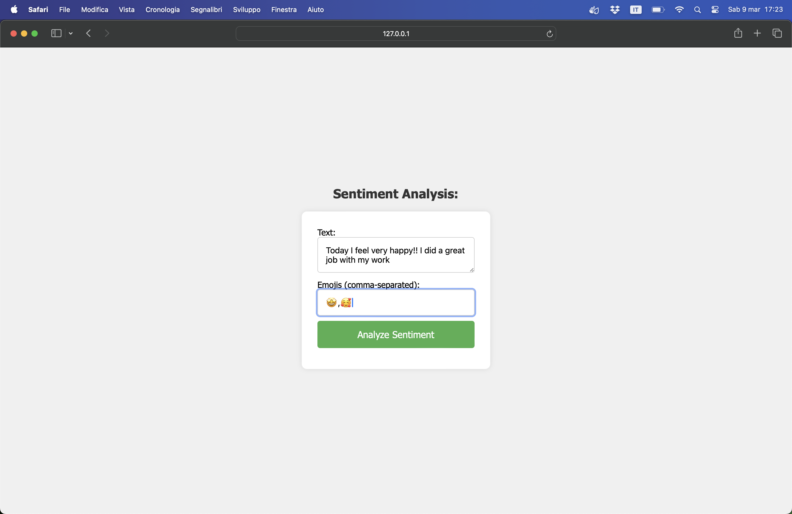
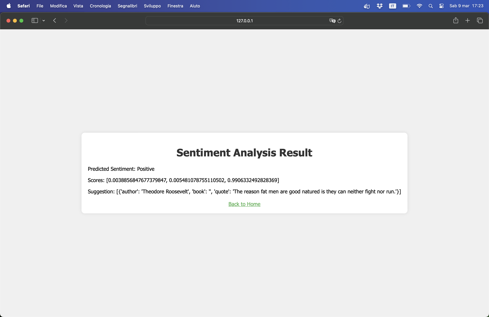

# Sentiment Analysis Web Application

This Flask web application allows users to express their mood with text and emojis, providing sentiment analysis results along with a suggested quote.

 

## Technologies Used

- **Flask**: Web framework for building the application.
- **FastAPI**: Used for handling HTTP exceptions.
- **Transformers Library**: Utilized to work with the sentiment analysis model.
- **HTML/CSS**: Front-end technologies for designing and styling.
- **Quote Library**: A custom library for generating quotes.
- **numpy**: Used for numerical operations in Python.

## Model

The sentiment analysis model employed in this application is based on the RoBERTa-base architecture. It has been trained on an extensive dataset comprising approximately 124 million tweets spanning the period from January 2018 to December 2021. The training of the model involved finetuning for sentiment analysis tasks using the TweetEval benchmark. It is specifically designed and trained for the English language.. 
### How the model works? 
In the Flask web application, the model is seamlessly integrated to analyze user-provided text and emojis. The preprocessing step involves appending emojis to the text, followed by tokenization and obtaining sentiment scores. The model's predictions contribute to categorizing the sentiment as Negative, Neutral, or Positive, forming the basis for the application's response.

## How the App Works

1. **Input**: Users enter text and emojis on the home page.

2. **Analysis**: The application preprocesses the input by appending emojis to the text. It then tokenizes the input and obtains sentiment scores using the pre-trained model.

3. **Sentiment Prediction**: The model predicts the sentiment label (Negative, Neutral, Positive) based on the obtained scores.

4. **Suggested Response**: A quote is generated based on the predicted sentiment. Positive sentiments trigger positive quotes, while other sentiments result in motivational quotes.

5. **Result Display**: The predicted sentiment, scores, and suggested response are displayed on a results page.


## Code Overview

- The Flask routes are defined in `app.py`.
- HTML templates are stored in the `templates` folder.
- Sentiment analysis is performed in the `analyze_sentiment` function.
- Quotes are generated based on sentiment in the `generate_suggestion` function.

### More in deep...
```python
MODEL = "cardiffnlp/twitter-roberta-base-sentiment-latest"
```
This line defines the identifier for the pre-trained RoBERTa-base sentiment analysis model.
```python
tokenizer = AutoTokenizer.from_pretrained(MODEL)
```
This line initializes a tokenizer suitable for the specified sentiment analysis model. The tokenizer converts input text into a format compatible with the model.

```python
model = AutoModelForSequenceClassification.from_pretrained(MODEL)
```
This line loads the pre-trained sentiment analysis model. The model is designed for sequence classification tasks and is fine-tuned for sentiment analysis on Twitter data.

```python
class SentimentRequest(BaseModel):
    text: str
    emojis: list
```
This section of the code defines a data model class named `SentimentRequest`. This class is derived from `BaseModel`, which is part of the pydantic library and is used for creating data validation and serialization models. The `SentimentRequest` class has two attributes:
 - `text`: This attribute represents the text input provided by the user for sentiment analysis. It is of type `str` (string).
 - `emojis`: This attribute represents a list of emojis provided by the user for sentiment analysis. It is of type `list`.
Instances of the `SentimentRequest` class will be created to encapsulate the input data received from the user when making a sentiment analysis request. These instances will be used as input parameters for the `analyze_sentiment` function, ensuring that the expected data structure is maintained and validated.

```python
def preprocess(text, emojis):
    processed_text = f"{text} {' '.join(emojis)}"
    return processed_text
```
The function concatenates the input text with the emojis using an f-string. It adds a space between the text and the emojis using `join(emojis)`. The resulting `processed_text` is a single string that includes the original text and the emojis.

```python
def generate_suggestion(sentiment):
    if sentiment == "Positive":
        random_positive_word = random.choice(positive_words)
        return quote(random_positive_word, limit=1)
    else:
        random_motivational_word = random.choice(motivational_words)
        return quote(random_motivational_word, limit=1)
```
This function is designed to provide a personalized suggestion or quote based on the sentiment predicted by the model. If the sentiment is positive, it selects a positive word and generates a quote. Otherwise, it selects a motivational word and generates a quote. The specific quotes and words are defined in the `positive_words` and `motivational_words` lists in your code.

```python
try:
...
except Exception as e:
        raise HTTPException(status_code=500, detail=str(e))
```
The purpose of this block is to handle unexpected errors during the execution of the application and provide a meaningful HTTP response. It helps in logging and debugging by conveying relevant error information to the user or developer. 

```python
encoded_input = tokenizer(processed_input, return_tensors='pt', max_length=256, truncation=True)
```
Using the Hugging Face Transformers library to tokenize the processed input and create a PyTorch tensor: 
- `tokenizer`: This is an instance of the tokenizer created earlier using `AutoTokenizer.from_pretrained(MODEL)`. It's responsible for converting input text into a format suitable for the sentiment analysis model.
- `processed_input`: This is the text that has been preprocessed, combining the user-provided text and emojis using the `preprocess` function.
- `return_tensors='pt'`: This parameter specifies that the tokenizer should return PyTorch tensors. The resulting `encoded_input` will be a dictionary containing tensors.
- `max_length=256`: This parameter sets the maximum length of the tokenized sequence. If the combined length of the text and emojis exceeds this value, it will be truncated or padded as necessary.
- `truncation=True`: This parameter enables truncation of the tokenized sequence if it exceeds the specified maximum length. Truncation is a common practice when dealing with text inputs to fit them into fixed-size models.
The `encoded_input` variable will contain the tokenized representation of the processed input in a format suitable for input to the sentiment analysis model. It's typically used as an argument when making predictions with the model. The specific structure of `encoded_input` will depend on the tokenizer and model used. In this case, it will likely be a dictionary with keys such as 'input_ids', 'attention_mask', etc., containing the tokenized and encoded information needed for the model.

```python
output = model(**encoded_input)
```
Using the pre-trained sentiment analysis model to obtain predictions for the tokenized and encoded input:
- `model`: This is an instance of the sentiment analysis model created earlier using `AutoModelForSequenceClassification.from_pretrained(MODEL)`. It's responsible for predicting sentiment based on the tokenized input.
- `encoded_input`: This is the dictionary containing the tokenized and encoded representation of the processed input. It's typically generated by the tokenizer and formatted in a way suitable for the specific model's input requirements.
- `output`: This line invokes the sentiment analysis model with the tokenized input. The `**` syntax is used for unpacking the contents of the `encoded_input` dictionary as keyword arguments to the model.
- The `output` variable will contain the model's predictions. The specific contents of `output` depend on the architecture of the model. For sentiment analysis, it commonly includes logits or probabilities for each sentiment class.

```python
sentiment_labels = ["Negative", "Neutral", "Positive"]
predicted_sentiment = sentiment_labels[np.argmax(scores)]
```
Responsible for determining the predicted sentiment label based on the scores obtained from the sentiment analysis model:
- `sentiment_labels`: This is a list that maps the index positions of sentiment classes to their corresponding labels. In this case, index 0 corresponds to "Negative," index 1 to "Neutral," and index 2 to "Positive."
- `np.argmax(scores)`: This NumPy function returns the index of the maximum value in the `scores` array. The `scores` array is the output of the sentiment analysis model, representing the model's confidence or probability scores for each sentiment class.
- `predicted_sentiment`: This line assigns the sentiment label corresponding to the index with the highest score to the variable `predicted_sentiment`. It effectively identifies the predicted sentiment class based on the model's output.
After this step, `predicted_sentiment` will contain a string representing the predicted sentiment label, such as "Negative," "Neutral," or "Positive." This label is then used to provide information about the sentiment in the final result or for further processing in your application.

```python
suggestion = generate_suggestion(predicted_sentiment)
```
Calling a function named `generate_suggestion` to create a suggestion based on the predicted sentiment.

```python
@app.route('/')
def index():
    return render_template('index.html')
```
Defines a route in your Flask application that renders the 'index.html' template when a user accesses the root URL ('/'):
- `@app.route('/')`: This is a decorator in Flask that associates a function with a specific URL route. In this case, the route is the root URL ('/'), which is the main entry point for your application.
- `return render_template('index.html')`: Inside the `index` function, this line uses `render_template` to render the 'index.html' template. The rendered HTML content will be sent as the HTTP response to the user's browser.
The purpose of this route is to display the 'index.html' page when a user visits the root of your web application.

```python
@app.route('/analyze_sentiment', methods=['POST'])
def analyze_sentiment_route():
    text = request.form.get('text')
    emojis = request.form.get('emojis').split(',')
    sentiment_request = SentimentRequest(text=text, emojis=emojis)
    try:
        result = analyze_sentiment(sentiment_request)
        return render_template('result.html', result=result)
    except HTTPException as e:
        return render_template('error.html', error_message=str(e))
```
Defines a route in your Flask application that handles the sentiment analysis form submission: 
- `@app.route('/analyze_sentiment', methods=['POST'])`: This decorator associates the `analyze_sentiment_route` function with the '/analyze_sentiment' URL route and specifies that it should only respond to HTTP POST requests.
- `text` = request.form.get('text'): This line retrieves the value of the 'text' field from the form submission. It uses the Flask request object to access form data.
- `emojis` = request.form.get('emojis').split(','): This line retrieves the value of the 'emojis' field from the form submission and splits it into a list using commas as separators.
- `sentiment_request` = SentimentRequest(text=text, emojis=emojis): This creates an instance of the SentimentRequest class, which was defined earlier in your code. It encapsulates the text and emojis for the sentiment analysis.
- `result = analyze_sentiment(sentiment_request)`: This line calls the `analyze_sentiment` function with the `SentimentRequest` instance, obtaining the sentiment analysis results.
- `return render_template('result.html', result=result)`: If the sentiment analysis is successful, this line renders the 'result.html' template, passing the analysis results as a variable named `result`.
- `except HTTPException as e:`: This block catches any `HTTPException` that might be raised during the sentiment analysis process. If an exception occurs, it renders an 'error.html' template with the error message.
This route is responsible for handling form submissions, performing sentiment analysis, and displaying the results on the 'result.html' page. The 'error.html' page is used to handle exceptions that might occur during the sentiment analysis process.


Feel free to explore the code for more details!

## Running Locally

1. Clone the repository.
2. Install the required dependencies using `pip install -r requirements.txt`.
3. Run the Flask app with `python app.py`.
4. Access the application at [http://localhost:5000/](http://localhost:5000/).

## License

This project is licensed under the [MIT License](LICENSE).
